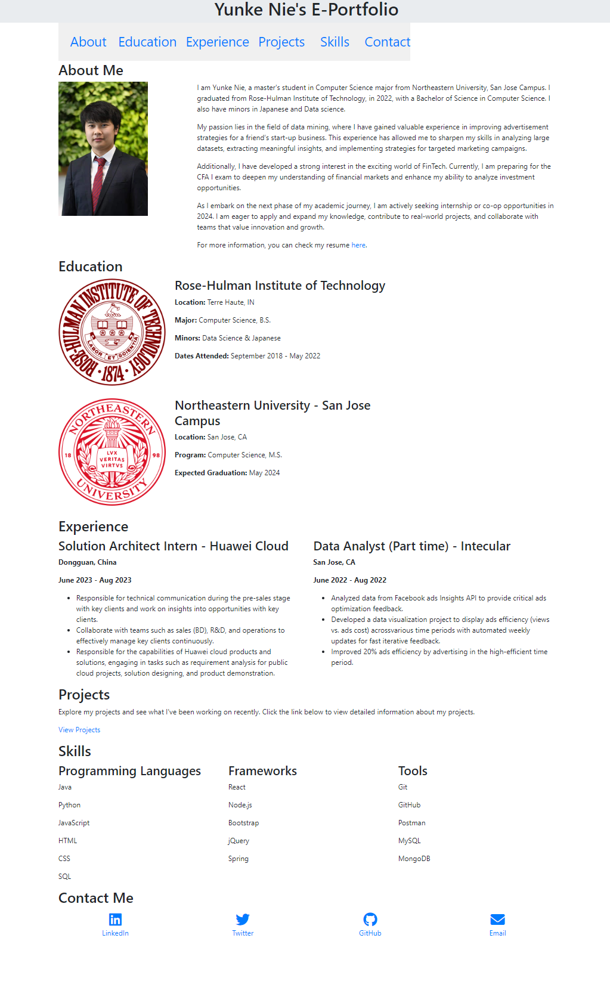
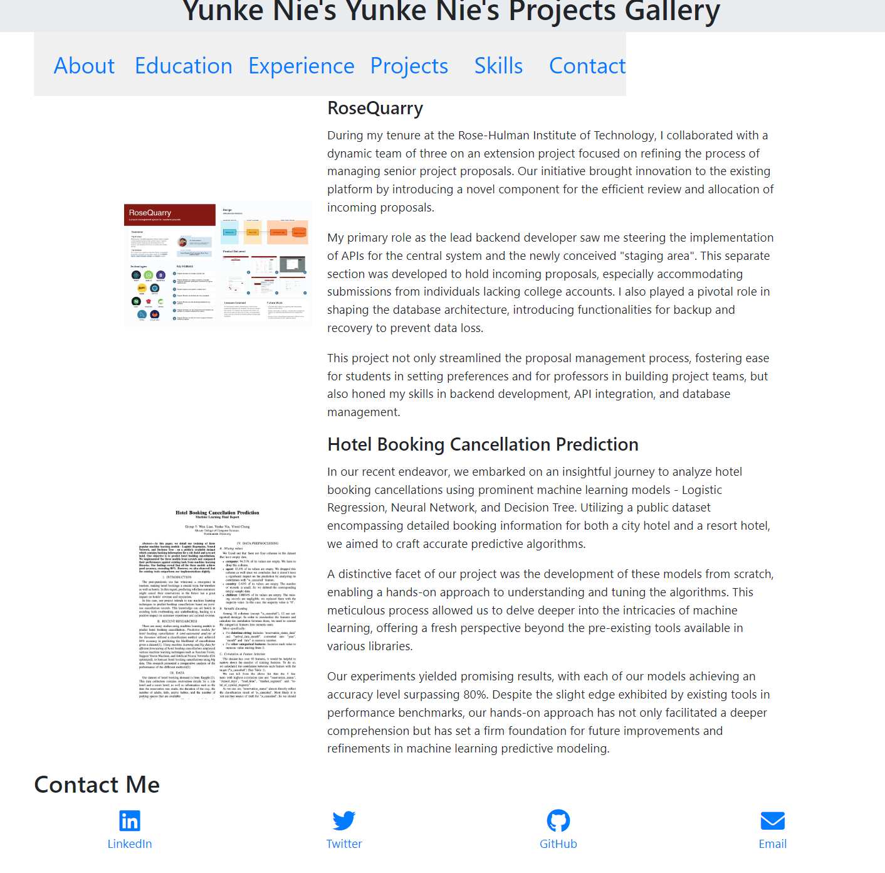

# Yunke Nie's E-Portfolio web page

> Author: Yunke Nie
> 
> Course Link: [https://johnguerra.co/classes/webDevelopment_fall_2023/](https://johnguerra.co/classes/webDevelopment_fall_2023/)
> 
> Design document is also included in the readme file.
> 
> [Introduction video](https://northeastern.hosted.panopto.com/Panopto/Pages/Viewer.aspx?id=5c10bafc-9b4c-43fc-8029-b08300996236)

The website is deployed at [https://yunke-nie.github.io/](https://yunke-nie.github.io/) via GitHub Pages.

## Project Description

This a my personal E-Portfolio web page. This project is a requirment for the [Northeastern CS5610](https://johnguerra.co/classes/webDevelopment_fall_2023/). It contains my personal information, resume, my projects, and my contact information. I hope this website could be a good way to introduce myself to others, especially to employers and recruiters. I also hope this website could be a good way to practice my web development skills. Furthermore, I will extend this website to have more pages and functions in the future.

## User Personas

- Recruiters & Employers: They are the main users of this website. They are looking for a candidate who is a good fit for their company. They want to know more about the candidate's background, skills, and experience. They also want to know the candidate's contact information so that they can contact the candidate for an interview.
- Colleagues & Classmates: They are also the users of this website. They may want to know the person's background, skills, and experience, which may help them to decide whether to work with this person or not. They may also want to know the person's contact information so that they can contact the person for a team project.

## User Stories
- As recruiters of a tech company, they may want to know the candidate's background, skills, and experience, so that I can decide whether to hire this candidate or not. Browsing the candidate's personal website is an efficient way to know these. Also, it shows the candidate's web development skills. The contact info can let them contact Yunke as soon as possible.
- As students of Northeastern, they may want to find an experienced students with enough skills to collaborate with. By browsing Yunke's personal website, they can know Yunke's background, skills, and experience. The contact info can let them contact Yunke as soon as possible.

## Design Mockup
This project's wireframe is designed by [Figma](https://www.figma.com/file/IqNDHDPHoxDejVxiUfLzHb/Untitled?type=whiteboard&node-id=0%3A1&t=Q4XuxI0LIa5DZk6O-1). 

## Website Overview

### Home Page (index.html)

Here is the screenshot of the home page. 

Project page:

### Instruction to build

1. Clone the repository
2. Use `npm install` to install all the dependencies
3. Use `npm run format` to format the code with Prettier
4. Use `npm run lint` to lint the code with ESLint
5. Use `npm run start` to host the project on local port 8080
   